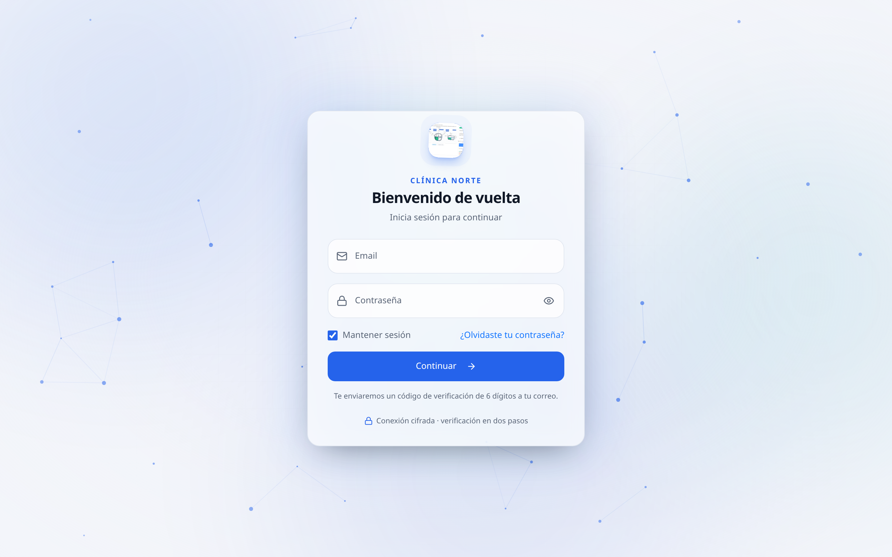
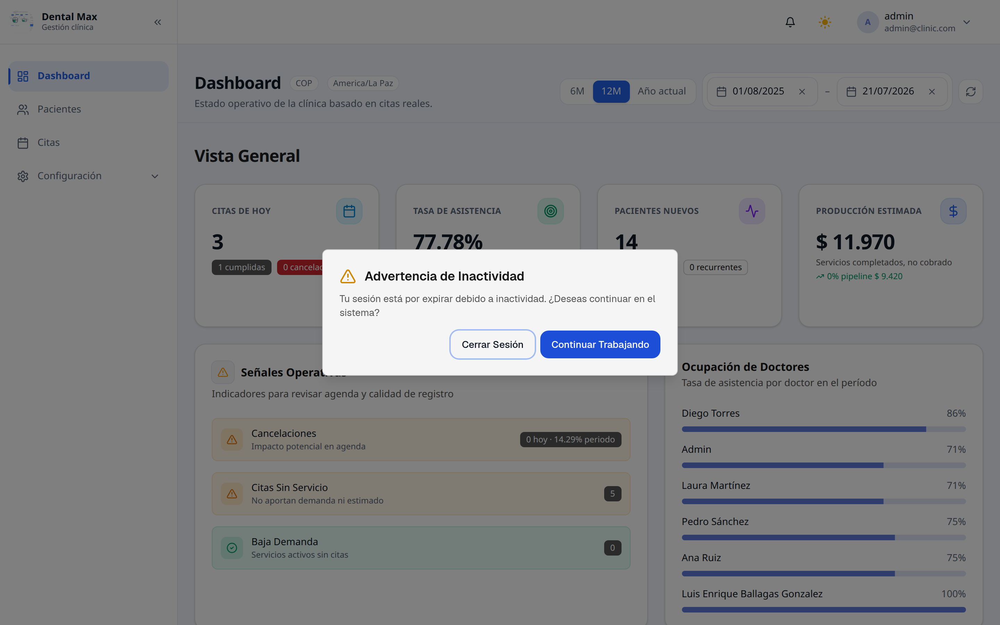
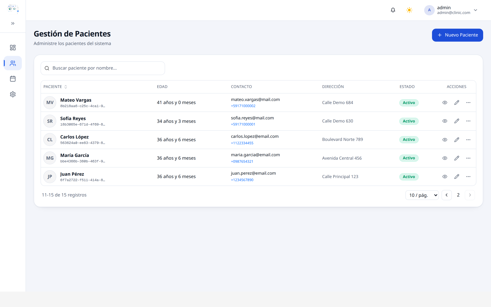
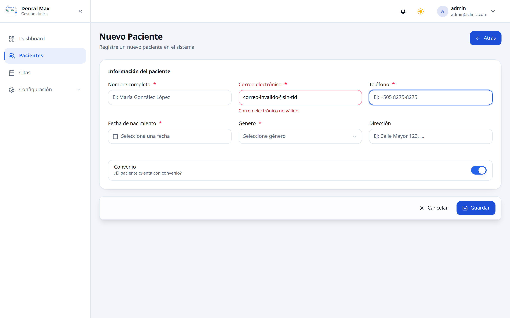
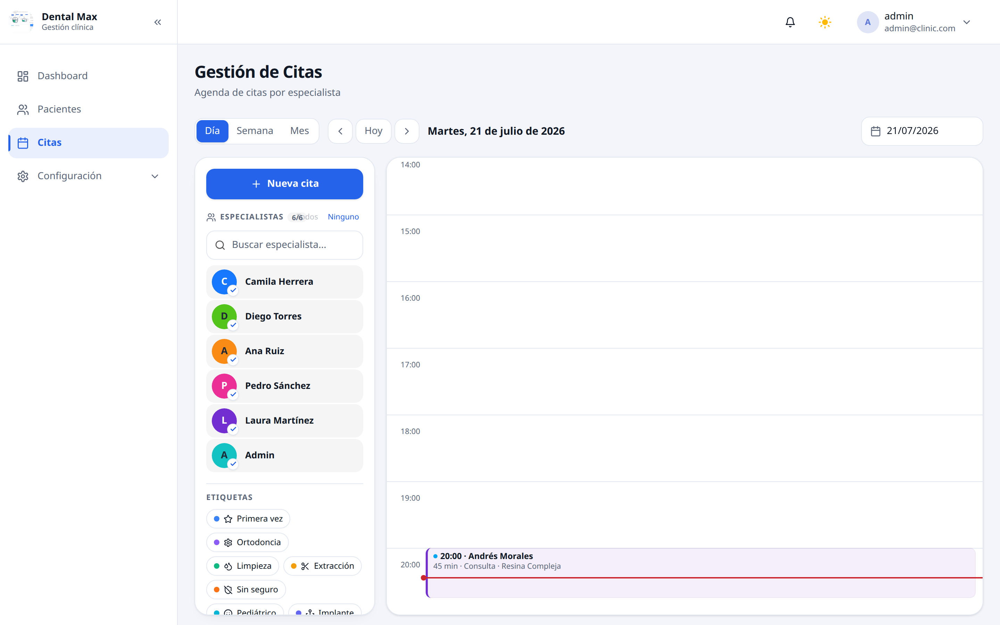
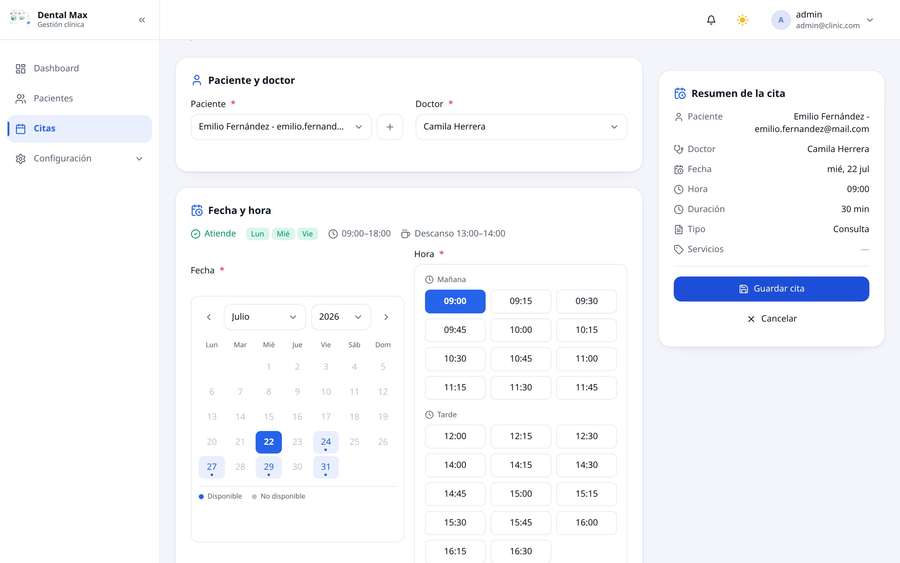
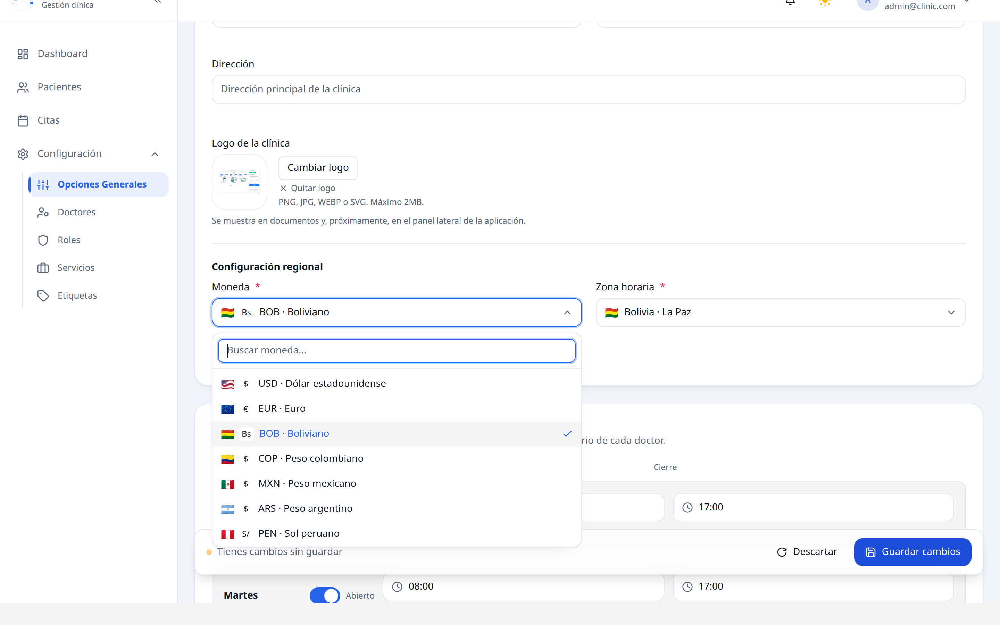
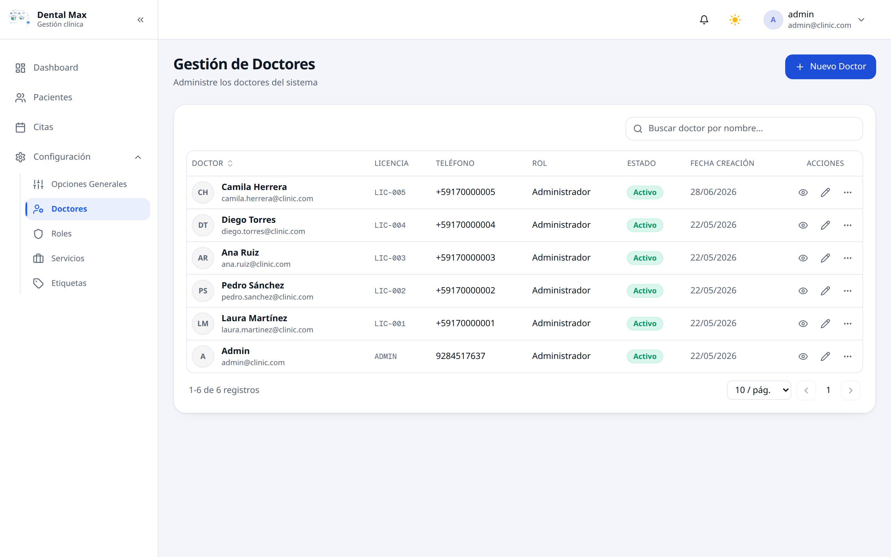
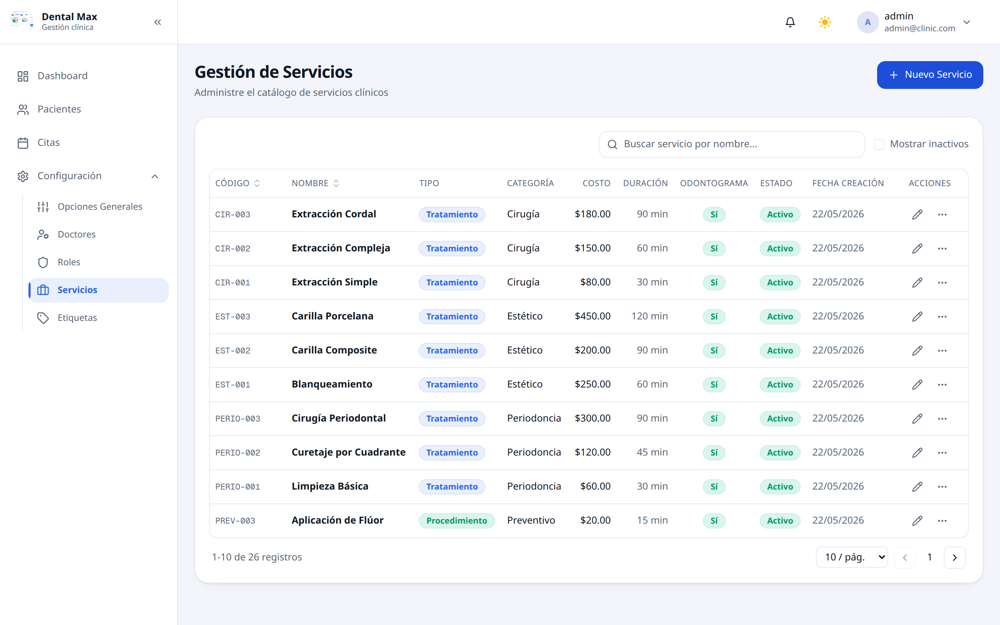
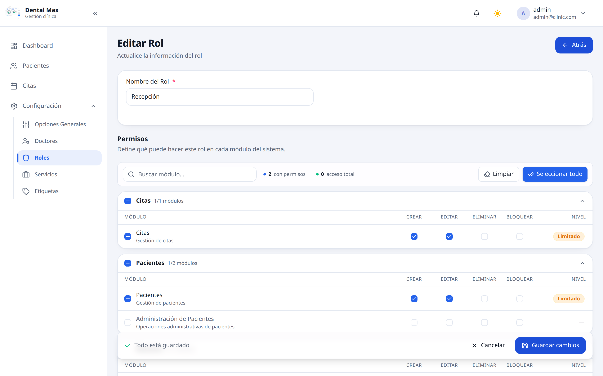

# Manual de Usuario — Clinic Flow 360

> Guía práctica para el trabajo diario con el sistema. Explica, paso a paso, cómo utilizar Clinic Flow 360 en la operación cotidiana: pacientes, agenda de citas, consulta clínica con odontograma, servicios, doctores, roles y configuración.

**Versión del documento:** 2026-07-16 · **Aplicación:** Clinic Flow 360 (Kodewave Solutions)

---

## Índice

1. [Introducción y propósito](#1-introducción-y-propósito)
2. [Requisitos](#2-requisitos)
3. [Perfiles de usuario y permisos](#3-perfiles-de-usuario-y-permisos)
4. [Inicio de sesión y seguridad de la sesión](#4-inicio-de-sesión-y-seguridad-de-la-sesión)
5. [Cómo moverse por la aplicación](#5-cómo-moverse-por-la-aplicación)
6. [Mensajes y avisos del sistema](#6-mensajes-y-avisos-del-sistema)
7. [Panel de inicio](#7-panel-de-inicio)
8. [Pacientes](#8-pacientes)
9. [Agenda de citas](#9-agenda-de-citas)
10. [Consulta clínica: historia clínica y odontograma](#10-consulta-clínica-historia-clínica-y-odontograma)
11. [Flujo completo: de la recepción al cierre de la consulta](#11-flujo-completo-de-la-recepción-al-cierre-de-la-consulta)
12. [Configuración](#12-configuración)
13. [Mi cuenta y contraseña](#13-mi-cuenta-y-contraseña)
14. [Accesibilidad y uso en dispositivos móviles](#14-accesibilidad-y-uso-en-dispositivos-móviles)
15. [Privacidad y manejo de datos del paciente](#15-privacidad-y-manejo-de-datos-del-paciente)
16. [Recomendaciones de uso diario y buenas prácticas](#16-recomendaciones-de-uso-diario-y-buenas-prácticas)
17. [Preguntas frecuentes (FAQ)](#17-preguntas-frecuentes-faq)
18. [Resolución de problemas](#18-resolución-de-problemas)
19. [Glosario](#19-glosario)

---

## 1. Introducción y propósito

**Clinic Flow 360** es la plataforma de gestión integral para clínicas dentales. Reúne en un solo lugar todo lo que el equipo de la clínica necesita para operar:

- **Pacientes:** ficha completa, historial clínico y documentos adjuntos.
- **Agenda de citas:** programación por doctor y por día, con disponibilidad de horarios.
- **Consulta clínica:** historia clínica odontológica y **odontograma digital** (marcado pieza por pieza).
- **Catálogo de servicios** y **gestión de doctores**.
- **Roles y permisos** para controlar qué puede hacer cada persona.
- **Configuración de la clínica:** datos, logo, moneda, zona horaria y horario de atención.

El valor central del sistema consiste en reducir el papeleo, mantener la información clínica ordenada y trazable, y ofrecer un flujo de trabajo claro desde que el paciente agenda hasta que se cierra la consulta.

Toda la interfaz está en **español**.

---

## 2. Requisitos

| Requisito | Detalle |
|---|---|
| **Dispositivo** | Computadora, tablet o teléfono. La aplicación se adapta a pantallas pequeñas mediante un menú lateral plegable. |
| **Navegador** | Un navegador moderno y actualizado (Chrome, Edge, Firefox o Safari). |
| **Conexión** | Conexión a internet estable. |
| **Acceso** | Una cuenta creada por el administrador de la clínica (correo y contraseña). No existe registro público: las cuentas se crean desde *Configuración → Doctores*. |
| **Segundo factor** | Al iniciar sesión se recibe un **código de verificación de 6 dígitos por correo** (autenticación en dos pasos). |

> **Recomendación:** tenga a mano el acceso a su correo electrónico al iniciar sesión, ya que el código de verificación llega a esa dirección.

---

## 3. Perfiles de usuario y permisos

El acceso a cada función depende del **rol** asignado a la cuenta. Los roles se gestionan en *Configuración → Roles* y definen permisos **por módulo**, con cuatro acciones posibles:

| Acción | Qué habilita |
|---|---|
| **Crear** | Dar de alta nuevos registros (por ejemplo, un paciente nuevo). |
| **Editar** | Modificar registros existentes. |
| **Eliminar** | Dar de baja o desactivar registros. |
| **Bloquear** | Restringir el uso de un registro sin borrarlo del sistema. A diferencia de **Eliminar**, el registro se conserva para consulta, pero queda impedido para nuevas operaciones (por ejemplo, dejar un servicio o un doctor fuera de uso sin eliminar su historial). |

Un rol con **Acceso total** dispone de las cuatro acciones en todos los módulos. Perfiles habituales:

- **Administrador:** acceso total; gestiona doctores, roles, servicios y configuración de la clínica.
- **Personal clínico:** trabaja con pacientes, agenda y consulta clínica según los permisos que el administrador le haya asignado.

> Si una opción o un botón no aparece en su pantalla, se debe a que su rol **no tiene el permiso** para esa acción. En ese caso, comuníquese con el administrador de la clínica.

---

## 4. Inicio de sesión y seguridad de la sesión

La aplicación protege el acceso con **contraseña más verificación en dos pasos (OTP)**.

*Figura 1. Pantalla de inicio de sesión con verificación en dos pasos.*

**Paso a paso:**

1. Abra la aplicación. Se muestra la pantalla **"Bienvenido de vuelta"** con el logo de la clínica.
2. Escriba su **correo** y su **contraseña**.
3. De forma opcional, active **"Mantener sesión"** cuando utilice un equipo de confianza, para no tener que iniciar sesión con tanta frecuencia.
4. Pulse **Continuar**.
5. Revise su correo: recibirá un **código de 6 dígitos**. Escríbalo en la pantalla de verificación.
6. El sistema valida el código y da acceso al panel de inicio.

**Conexión cifrada:** la contraseña viaja cifrada. La pantalla lo indica con el texto "Conexión cifrada · verificación en dos pasos".

### 4.1 Si olvidó su contraseña

1. En la pantalla de inicio de sesión, pulse **"¿Olvidaste tu contraseña?"**.
2. Ingrese su correo y siga las instrucciones que reciba por correo para **restablecerla**.
3. Cree una contraseña nueva y vuelva a iniciar sesión.

### 4.2 Cierre de sesión por inactividad

Por seguridad, cuando la sesión permanece inactiva durante un tiempo, el sistema muestra un aviso: **"Advertencia de inactividad"**. Ante ese aviso puede elegir:

- **Continuar trabajando:** mantiene la sesión abierta.
- **Cerrar sesión:** sale de forma segura.

Si no responde al aviso, la sesión se cierra automáticamente. Esta medida protege la información del paciente en equipos compartidos.

*Figura 2. Aviso de inactividad de la sesión.*

---

## 5. Cómo moverse por la aplicación

Una vez dentro, la pantalla se organiza en tres zonas:

- **Menú lateral (izquierda):** contiene la navegación principal. Las opciones que aparecen **dependen del rol** de la cuenta:
  - **Administrador:** Panel de inicio (Dashboard), Pacientes, Citas y **Configuración** (con sus subsecciones: Opciones Generales, Doctores, Roles, Servicios y Etiquetas).
  - **Doctor (personal clínico):** Panel de inicio, **Mis Citas** y Pacientes. Este perfil **no accede a Configuración** ni a sus subsecciones.
  - **Paciente:** Panel de inicio, **Mis Citas** e **Historial**.

  En pantallas pequeñas, el menú se abre con el botón de menú (☰).
- **Barra superior (derecha):** el icono de campana de **notificaciones**, el cambio de **tema claro/oscuro** (íconos 🌙 / ☀️) y el **menú de la cuenta** (que muestra el correo y da acceso a *Perfil*, a *Cambiar contraseña* y a *Cerrar sesión*).
- **Área de contenido (centro):** la pantalla del módulo que se esté utilizando.

La navegación entre módulos se realiza siempre desde el menú lateral. Las subsecciones de Configuración solo están disponibles para el rol administrador. El sistema conserva el contexto de trabajo mientras se desplaza entre secciones.

> **Centro de notificaciones:** el icono de campana de la barra superior está reservado para los avisos de la clínica. En la versión actual funciona como indicador visual y todavía no abre un panel de notificaciones; esta función está prevista para una versión posterior. Los avisos de resultado de cada acción (confirmaciones, errores y advertencias) se muestran como mensajes emergentes, descritos en la sección [Mensajes y avisos del sistema](#6-mensajes-y-avisos-del-sistema).

---

## 6. Mensajes y avisos del sistema

El sistema comunica el resultado de cada acción mediante avisos emergentes breves que aparecen en pantalla. Conocer su significado permite trabajar con seguridad.

| Tipo de aviso | Cuándo aparece | Cómo interpretarlo |
|---|---|---|
| **Confirmación (éxito)** | Después de guardar, crear, editar o eliminar un registro correctamente. | La acción se completó y los datos quedaron registrados. |
| **Error** | Cuando una acción no se pudo completar. | El texto describe la causa. Corrija lo indicado y vuelva a intentarlo. |
| **Validación de formulario** | Al salir de un campo con un dato faltante o con formato incorrecto. | Aparece un mensaje en rojo debajo del campo, con la corrección concreta. |
| **Advertencia** | Antes de una acción sensible o cuando hay cambios sin guardar. | Revise la información antes de continuar. |

Avisos frecuentes y su significado:

- **"Credenciales inválidas":** el correo o la contraseña no coinciden, o la cuenta no existe o está inactiva.
- **"Tienes cambios sin guardar":** hay modificaciones pendientes; pulse **Guardar cambios** para aplicarlas o **Descartar** para desecharlas.
- **Mensaje de conflicto de horario:** el horario elegido interfiere con otra cita del doctor o queda fuera del horario de atención. Elija un horario disponible.
- **Solo lectura:** la información pertenece a una visita finalizada y no puede modificarse; solo puede consultarse.

Los mensajes de error indican con precisión la causa. Cuando un error persista después de aplicar la corrección sugerida, consulte la sección [Resolución de problemas](#18-resolución-de-problemas).

---

## 7. Panel de inicio

Al entrar, la aplicación muestra el **Panel de inicio** (Dashboard), la pantalla de bienvenida con un resumen visual de la actividad de la clínica, organizado en tres vistas:

- **Visión general:** totales de citas del día y del mes, con la distribución por estado.
- **Productividad:** actividad por doctor, para comparar la carga de trabajo del equipo.
- **Pacientes:** altas recientes y pacientes activos.

> **Nota:** en esta versión, las cifras del panel de inicio son ilustrativas (datos de muestra) y no reflejan aún los datos reales de la clínica. Para operar (agendar, registrar pacientes o atender consultas) utilice siempre las secciones dedicadas del menú lateral.

---

## 8. Pacientes

El módulo **Pacientes** es el eje de la ficha del paciente.

### 8.1 Ver la lista de pacientes

1. En el menú lateral, ingrese a **Pacientes**.
2. Se muestra una tabla con: paciente (nombre e inicial), **edad**, **contacto** (correo y teléfono), **dirección** y **estado**.
3. El **estado** se presenta como una etiqueta: **Activo** (verde) o **Inactivo** (gris).

*Figura 3. Listado de pacientes.*

**Buscar y ordenar:**

- Utilice el buscador **"Buscar paciente por nombre…"**. La búsqueda **ignora mayúsculas y tildes** (escribir *"jose"* encuentra *"José"*).
- Pulse el encabezado de una columna para **ordenar** por ese campo.
- En la parte inferior se controla la **paginación** (registros por página).

### 8.2 Registrar un paciente nuevo

1. En la lista de Pacientes, pulse **+ Nuevo Paciente**.
2. Complete el formulario (nombre, fecha de nacimiento, contacto, dirección y demás datos).
3. Los campos se validan **al salir de cada campo**: si falta un dato o su formato es incorrecto, aparece un mensaje claro y específico debajo del campo (por ejemplo, sobre el formato del correo o de la fecha).
4. Pulse **Guardar**.

> Los campos obligatorios están marcados con un asterisco rojo **\***.

*Figura 4. Alta y edición de la ficha de un paciente.*

### 8.3 Ver y editar la ficha de un paciente

1. En la lista, pulse el ícono de **ver** (👁, "Ver historial") para abrir su **ficha**. Si desea ir directamente a la edición, utilice el ícono de **editar** (✏️).
2. Desde la ficha se accede a su información, su **historia clínica**, su **odontograma** y sus **citas** (el historial de citas se detalla en la sección 8.6).
3. Para modificar datos, utilice el ícono de **editar** (✏️) o el botón de edición dentro de la ficha.

### 8.4 Documentos adjuntos

Dentro de la ficha del paciente se pueden **adjuntar archivos** (radiografías, consentimientos, estudios):

**Adjuntar un archivo:**

1. Diríjase a la sección **Archivos** de la ficha del paciente y pulse **Agregar**.
2. Arrastre el archivo o pulse para seleccionarlo, y elija su **categoría** (Radiografía, Consentimiento, Imagen clínica u Otro). De forma opcional, escriba una **nota**. Se admiten archivos **JPG, PNG, WEBP o PDF**, con un **tamaño máximo de 10 MB por archivo**.
3. Confirme la carga. El documento queda asociado a la ficha del paciente y agrupado por su categoría.

**Consultar y descargar:** los archivos ya cargados se listan en la sección **Archivos**, agrupados por categoría, con su nombre, su fecha y su tamaño. Pulse el ícono de **descarga** para guardar una copia del archivo en su dispositivo. La descarga está siempre disponible.

**Eliminar:** cuando su rol dispone del permiso correspondiente, cada archivo muestra el ícono de **eliminar** (🗑). Al usarlo, el sistema solicita confirmación e indica que la acción no se puede deshacer. Si ese ícono no aparece, su rol no tiene permiso para eliminar adjuntos.

> Adjunte únicamente documentos que correspondan al paciente y verifique el nombre antes de subirlos, ya que forman parte de su registro clínico.

### 8.5 Activar o desactivar un paciente

Desde el menú de acciones (**⋯**) de cada fila se puede **desactivar** un paciente activo o **reactivarlo**. Un paciente inactivo se conserva en el sistema, pero queda marcado como tal y deja de aparecer en las operaciones habituales.

### 8.6 Historial de citas del paciente

Dentro de la ficha del paciente, junto a su historia clínica, se muestra la lista de sus **citas**, ordenadas por fecha. Cada cita se presenta como una tarjeta con su **fecha**, el **servicio** (o el motivo), la **hora** y el **doctor** que la atiende, diferenciada por su estado:

- **Citas agendadas:** incluyen accesos directos para **Reagendar** o **Cancelar** la cita (sección 9.4).
- **Cita en curso:** se destaca como la consulta activa del paciente.
- **Citas completadas:** ofrecen el enlace **"Ver historial de esta visita"**, que abre la visita finalizada en modo **solo lectura** (odontograma e historia clínica de esa consulta, sin posibilidad de modificarlos).

Este listado permite dar continuidad a la atención: consultar qué se hizo en visitas anteriores y qué citas quedan por atender.

---

## 9. Agenda de citas

El módulo **Citas** organiza la agenda **por doctor y por día**.

*Figura 5. Agenda de citas por doctor y día.*

> **Nota sobre la vista según el rol:** para el rol clínico, este módulo se presenta como **Mis Citas**. En esa vista no aparece el selector de doctor y se muestran únicamente las citas propias. El resto del flujo descrito en este capítulo (programar una cita, estados, iniciar y completar la consulta) es equivalente.

### 9.1 Consultar la agenda

1. Ingrese a **Citas** en el menú lateral.
2. Seleccione el **doctor** y la **fecha**.
3. Se muestran las citas de ese doctor en ese día, ordenadas por hora.

### 9.2 Programar una cita nueva

1. En la agenda, pulse **+ Nueva Cita**.
2. Seleccione el **paciente**.
3. Seleccione el **doctor** y el **servicio** a realizar.
4. El sistema muestra los **horarios disponibles** del doctor para la fecha elegida. Elija un horario libre.
5. De forma opcional, en el campo **Etiquetas** seleccione una o varias etiquetas para clasificar la cita (por ejemplo, *Urgencia* o *Control*). Las etiquetas se administran en *Configuración → Etiquetas*.
6. Pulse **Guardar** para confirmar la cita.

> El sistema evita solapamientos: solo ofrece horarios realmente disponibles del doctor, dentro del horario de atención de la clínica.

*Figura 6. Programación de una nueva cita.*

### 9.3 Estados de una cita

Cada cita tiene un **estado** que refleja su situación en el flujo de atención. El sistema lo muestra con una etiqueta de color:

| Estado | Color | Significado |
|---|---|---|
| **Agendada** | Azul | La cita está programada y a la espera de ser atendida. |
| **En curso** | Morado | La consulta se ha iniciado y el paciente está siendo atendido. |
| **Completada** | Verde | La consulta se atendió y se cerró; la cita queda registrada. |
| **Cancelada** | Rojo | La cita se anuló y no se atenderá. |
| **No asistió** | Naranja | El paciente no se presentó a la cita en el horario previsto. |

Las acciones disponibles dependen del estado: una cita **Agendada** puede reprogramarse, cancelarse o iniciarse; una cita **En curso** puede completarse o cancelarse; y una cita **Completada**, **Cancelada** o **No asistió** queda cerrada y no admite esas acciones.

### 9.4 Reprogramar o cancelar

Desde el **menú de acciones (⋯)** de la cita en la agenda se gestiona una cita existente. Elija **Reagendar** para reprogramarla o **Cancelar cita** para anularla.

**Reagendar (reprogramar).** Disponible para citas en estado **Agendada**:

1. Abra el menú de acciones (⋯) de la cita.
2. Elija **Reagendar**.
3. En la ventana **Reagendar cita**, seleccione la nueva **fecha** y una **hora** disponible. El sistema valida la disponibilidad del doctor y avisa si el horario elegido no está libre.
4. Pulse **Reagendar cita** para confirmar. La cita conserva su duración original.

**Cancelar cita.** Disponible para citas **Agendada** o **En curso**:

1. Abra el menú de acciones (⋯) de la cita.
2. Elija **Cancelar cita**.
3. En la ventana de confirmación, que advierte que la acción no se puede deshacer, seleccione de forma **opcional** un motivo de cancelación (por ejemplo, *Paciente canceló* o *Urgencia / conflicto del doctor*). Al elegir *Otro* puede escribir una nota breve. El motivo no es obligatorio.
4. Pulse **Sí, cancelar cita** para confirmar. La cita queda marcada como **Cancelada**.

> La modificación de una cita se realiza mediante **reprogramar** o **cancelar** desde la agenda. El sistema no ofrece una pantalla separada de "editar cita completa".

### 9.5 Registrar la asistencia y actualizar el estado

El avance de cada cita se gestiona desde su **menú de acciones (⋯)** en la agenda. Las opciones disponibles dependen del estado de la cita (sección 9.3):

- **Iniciar consulta:** disponible en una cita **Agendada** (aparece como **Continuar consulta** cuando ya está **En curso**). Al iniciar la consulta, la cita pasa a **En curso**; esta acción es la forma en que el sistema registra que el paciente fue atendido. La cita queda marcada como **Completada** al finalizar la consulta en el espacio de trabajo clínico del paciente (sección 9.6).
- **Reagendar** y **Cancelar cita:** ver sección 9.4.

> El estado **No asistió** identifica las citas cuyo paciente no se presentó en el horario previsto. Se muestra entre los estados de la cita (sección 9.3) y queda registrado en el historial de citas.

### 9.6 Iniciar y completar la consulta

Cuando llega el momento de atender:

1. Desde la agenda (o desde la ficha del paciente), **inicie la consulta**. La cita pasa al estado **En curso** y el sistema abre el **espacio de trabajo clínico** del paciente (historia clínica y odontograma).
2. Realice el trabajo clínico (consulte la sección 10).
3. Al terminar, **finalice la cita**. El sistema guarda un **snapshot** (copia del estado / instantánea) del odontograma y marca la cita como **Completada**. De forma opcional, en ese mismo paso puede **programar una cita de seguimiento**.

> **Cita de seguimiento (opcional):** al finalizar la visita, active la opción de agendar un seguimiento para reutilizar los datos del paciente. El sistema arrastra a la nueva cita los **servicios planificados que quedaron pendientes** (los tratamientos marcados en el plan que aún no se ejecutaron) y solo requiere elegir el **doctor**, la **fecha** y un **horario disponible**. La cita de seguimiento aparece en la agenda con esos servicios pendientes. Esta opción puede omitirse: si no la activa, la visita se cierra sin agendar un seguimiento.

---

## 10. Consulta clínica: historia clínica y odontograma

Esta es la sección clínica del sistema, disponible desde la **ficha del paciente** durante una consulta.

> **Importante (integridad clínica):** la edición clínica solo está habilitada durante una **consulta activa**. Fuera de una consulta activa, o en visitas ya **finalizadas**, la información se muestra en **solo lectura** para preservar el registro. Para editar se requiere el permiso de **historia clínica**.

### 10.1 El odontograma digital

El odontograma representa la boca del paciente pieza por pieza y permite documentar el estado de cada una.

*Figura 7. Odontograma digital.*

- **Numeración internacional:** la notación sigue el estándar **FDI/ISO** de identificación dental. Cada pieza tiene un número de dos cifras que indica el cuadrante y la posición.
- **Vistas por diente:** cada pieza se representa por sus **caras**: vestibular, lingual o palatino, oclusal o incisal según el sector, mesial y distal. La vista muestra el título de la cara que se está marcando para evitar confusiones de orientación.
- **Superficies marcables:** dentro de cada cara se pueden marcar **superficies específicas**, de forma independiente. Esto permite documentar un hallazgo en una zona concreta sin afectar el resto de la pieza.
- **Estado y hallazgos:** registra caries mediante la escala **ICDAS**, restauraciones, tratamientos endodónticos, ausencias, coronas y otros estados. El color de la pieza refleja su condición y se mantiene coherente en todas las vistas.
- **Plan y realizado:** el sistema distingue lo **planificado** de lo **realizado**. Un tratamiento planificado se marca con un color de plan; al ejecutarse, pasa a marcarse como realizado. Así se puede seguir el avance del plan de tratamiento.

**Cómo marcar una pieza:**

1. Con la consulta activa, pulse la pieza (o la cara o la superficie concreta).
2. Seleccione el estado o el hallazgo en el panel que aparece.
3. Los cambios se **guardan automáticamente** mientras trabaja; un indicador muestra el estado de guardado.

### 10.2 Historia clínica de la visita

Junto al odontograma, la historia clínica de la consulta permite documentar la visita.

*Figura 8. Historia clínica de la visita.*

- **Motivo de consulta y dolor:** incluye el **diente asociado al dolor** (referencia FDI), de modo que el motivo queda vinculado a la pieza correspondiente.
- **Diagnóstico estructurado:** utiliza un subconjunto de códigos **CIE-10 dental** y permite marcar cada diagnóstico como *provisional* o *confirmado*. El odontograma puede **sugerir diagnósticos** a partir de los hallazgos registrados.
- **Hallazgos de examen:** extraoral e intraoral.
- **Anamnesis y antecedentes médicos** del paciente.

**Dictado por voz (opcional):** puede dictar notas por voz. De forma predeterminada se inserta la **transcripción tal cual**. Existe una opción para **formatear con inteligencia artificial** en **formato SOAP** (nota clínica estructurada en **S**ubjetivo, **O**bjetivo, **A**nálisis o evaluación y **P**lan) que está **desactivada de forma predeterminada**; actívela únicamente cuando la necesite.

### 10.3 Finalizar la visita

Al completar la consulta, la visita se **cierra**:

- Se guarda un **registro histórico** de la visita, que incluye una foto de la anamnesis y del odontograma al inicio y al final.
- La visita finalizada queda **en solo lectura**: se puede **consultar** en el historial, pero no modificar. Esta restricción preserva la integridad del registro clínico.
- En el **historial de visitas** se pueden revisar consultas anteriores, comparar el estado del odontograma antes y después, y verificar el avance de los planes de tratamiento.

---

## 11. Flujo completo: de la recepción al cierre de la consulta

Esta sección describe el recorrido de extremo a extremo de un paciente, desde que solicita una cita hasta que su consulta queda cerrada.

1. **Registro o localización del paciente.** Si el paciente es nuevo, se crea su ficha en **Pacientes → + Nuevo Paciente** (sección 8.2). Si ya existe, se localiza con el buscador.
2. **Programación de la cita.** En **Citas → + Nueva Cita** se selecciona el paciente, el doctor y el servicio, y se elige un horario disponible (sección 9.2). La cita queda en estado **Agendada**.
3. **Recepción del paciente.** El día de la cita, la agenda del doctor muestra la cita **Agendada**. Cuando el paciente llega y se le atiende, la asistencia queda registrada al **iniciar la consulta** desde el menú de acciones (⋯) de la cita (sección 9.5).
4. **Inicio de la consulta.** Desde la agenda o la ficha del paciente se **inicia la consulta**. La cita pasa a **En curso** y se abre el espacio de trabajo clínico (sección 9.6).
5. **Atención clínica.** Durante la consulta activa se documenta la historia clínica y se actualiza el odontograma. Los cambios se guardan automáticamente (sección 10).
6. **Cierre de la consulta.** Al terminar, se **finaliza la cita**. El sistema guarda el registro histórico y la foto (snapshot) del estado del odontograma, y marca la cita como **Completada**. De ser necesario, se programa una **cita de seguimiento** en el mismo paso.
7. **Consulta posterior.** La visita finalizada queda disponible en el **historial** del paciente en modo solo lectura, para revisión y continuidad de la atención.

Si el paciente no se presenta, la cita se registra como **No asistió**; si se anula con antelación, se marca como **Cancelada**.

---

## 12. Configuración

La sección **Configuración** (menú lateral) agrupa la administración de la clínica. Las opciones visibles dependen de los permisos de la cuenta.

### 12.1 Opciones Generales (datos y configuración regional)

En **Configuración → Opciones Generales** se administran la identidad y los parámetros regionales de la clínica:

- **Datos de la clínica:** nombre, teléfono y dirección.
- **Logo:** se sube con el selector de archivos (arrastre la imagen o pulse para elegirla). Se admiten los formatos **PNG, JPG, WEBP o SVG**, hasta **2 MB**. Se muestra en documentos y en la aplicación.
- **Configuración regional:**
  - **Moneda:** selector con **bandera del país, símbolo de la moneda y nombre** (por ejemplo, *🇨🇴 C$ · COP · Peso colombiano*). El buscador **ignora tildes y mayúsculas** y encuentra por **código, nombre o símbolo** (escribir *"dolar"*, *"USD"* o *"$"* funciona).
  - **Zona horaria:** selector **buscable** con **bandera y diferencia horaria (UTC)**. Se puede buscar por país, ciudad o desfase (por ejemplo, *"bogota"* o *"utc-5"*).
- **Horario de atención:** define, por día de la semana, si la clínica está **abierta** y sus horas de **apertura y cierre**.

**Para guardar cambios:** cuando se modifica algún dato, aparece la barra inferior con **Descartar** y **Guardar cambios**. La barra avisa con el texto **"Tienes cambios sin guardar"** hasta que se confirmen.

*Figura 9. Configuración regional de la clínica.*

### 12.2 Doctores

En **Configuración → Doctores** se gestiona al personal:

1. **Lista:** permite buscar (ignora tildes y mayúsculas), filtrar y paginar. Cada doctor muestra licencia, teléfono, **rol**, **estado** (Activo/Inactivo) y fecha de creación.
2. **+ Nuevo Doctor:** crea una cuenta con datos personales, **licencia** (número de matrícula o registro profesional del doctor), **rol** asignado, **avatar** (foto) y credenciales de acceso.
3. **Editar / Ver:** abre el detalle o edita un doctor existente.
4. **Estado:** activa o desactiva un doctor. Un doctor inactivo no puede recibir nuevas citas.

> Al crear un doctor se le asigna un **rol**, que define sus permisos en todo el sistema.

*Figura 10. Listado de doctores.*

### 12.3 Servicios

En **Configuración → Servicios** se administra el catálogo de tratamientos y servicios que ofrece la clínica:

1. **Lista:** permite buscar, filtrar y paginar los servicios.
2. **Crear servicio:** define su **código**, su **nombre**, su **tipo** y su **costo**. La **duración en minutos** es el dato que reserva el bloque de horario al agendar: determina cuánto tiempo ocupa la cita en la agenda del doctor. De forma opcional se indican la **categoría clínica**, una **descripción** y un **símbolo o ícono** para el odontograma.
3. **Editar** o **activar/desactivar** un servicio existente.

Los servicios se utilizan al **programar citas** (se selecciona el servicio a realizar). El servicio elegido fija la **duración** de la cita y, con ello, los horarios disponibles del doctor.

> Al programar la cita, el sistema guarda una copia de los datos del servicio (costo y duración) vigentes en ese momento. Modificar después el servicio en el catálogo no altera las citas ya agendadas, que conservan los valores con los que se programaron.

*Figura 11. Catálogo de servicios.*

### 12.4 Roles y permisos

En **Configuración → Roles** se define qué puede hacer cada perfil.

**Crear o editar un rol:**

1. Ingrese a **Roles** y pulse **Crear** (o edite uno existente).
2. Escriba el **nombre del rol** (por ejemplo, «Administración» o «Atención clínica»).
3. En la sección **Permisos**, se muestran los módulos del sistema agrupados por categoría (Citas, Pacientes, Doctores, entre otros). Para cada módulo, active las acciones: **Crear, Editar, Eliminar, Bloquear**.
4. Atajos útiles:
   - **Seleccionar todo:** otorga acceso total a todos los módulos.
   - **Limpiar:** quita todos los permisos.
   - El **buscador de módulos** ayuda a encontrar uno rápidamente.
5. Cada módulo muestra su **nivel** resultante: **Acceso total** o **Limitado**.
6. Pulse **Guardar cambios**.

> Los cambios de permisos afectan a **todos los doctores** que tengan ese rol.

*Figura 12. Editor de roles y permisos.*

### 12.5 Etiquetas

**Configuración → Etiquetas** es la pantalla donde se gestionan las etiquetas utilizadas para **clasificar y organizar registros** dentro del sistema.

---

## 13. Mi cuenta y contraseña

### 13.1 Editar el perfil

En el **menú de la cuenta** (barra superior) → **Perfil**, se pueden actualizar los **datos personales** y el **avatar** (foto de perfil).

### 13.2 Cambiar la contraseña

La contraseña se cambia desde el **menú de la cuenta** (barra superior), con la opción **"Cambiar contraseña"**, que abre una ventana para actualizarla. Elija una contraseña segura (combinación de mayúsculas, minúsculas, números y una longitud adecuada); la ventana indica con precisión si falta algún requisito.

> El administrador puede restablecer la contraseña de un doctor desde su registro, en **Configuración → Doctores**.

Si no recuerda su contraseña actual y no puede iniciar sesión, utilice el enlace **"¿Olvidaste tu contraseña?"** de la pantalla de inicio de sesión, según se describe en la sección [Si olvidó su contraseña](#41-si-olvidó-su-contraseña).

### 13.3 Cerrar sesión

En el **menú de la cuenta** → **Cerrar sesión**. Cierre la sesión siempre que utilice un equipo compartido.

---

## 14. Accesibilidad y uso en dispositivos móviles

La aplicación se adapta a computadoras, tablets y teléfonos.

- **Menú plegable:** en pantallas pequeñas, el menú lateral se abre y se cierra con el botón de menú (☰) situado en la parte superior. Al seleccionar una sección, el menú se repliega para dejar espacio al contenido.
- **Desplazamiento de tablas:** las tablas con muchas columnas (pacientes, doctores, servicios) permiten **desplazamiento horizontal**. Deslice el contenido de la tabla hacia los lados para ver todas las columnas sin que la página completa se mueva.
- **Tema claro y oscuro:** la barra superior incluye un control (íconos 🌙 / ☀️) para alternar entre el tema claro y el oscuro, según la preferencia de lectura y las condiciones de iluminación.
- **Formularios accesibles:** los campos indican con claridad su etiqueta, marcan los obligatorios con asterisco y muestran los errores con un mensaje específico debajo del campo. Los mensajes de error están asociados al campo correspondiente para su lectura asistida.
- **Uso táctil:** los botones y los elementos de la agenda y del odontograma están dimensionados para su uso con el dedo en pantallas táctiles.

---

## 15. Privacidad y manejo de datos del paciente

La información clínica es confidencial. El sistema incorpora medidas de protección y su uso adecuado depende también de buenas prácticas del equipo.

- **Cierre de sesión:** cierre siempre la sesión al terminar en un equipo compartido y no deje la aplicación abierta sin supervisión. El cierre automático por inactividad complementa esta medida, no la sustituye.
- **Acceso segmentado por permisos:** cada persona ve únicamente lo que su rol permite. No comparta sus credenciales; cada cuenta es personal.
- **Documentos adjuntos:** verifique que cada archivo corresponde al paciente correcto antes de adjuntarlo, ya que pasa a formar parte de su registro clínico.
- **Integridad del registro clínico:** las visitas finalizadas quedan en solo lectura. Esta restricción protege la información frente a modificaciones posteriores y garantiza la trazabilidad.
- **Pantalla a la vista:** evite mostrar la ficha o la historia clínica de un paciente en pantallas visibles para terceros en zonas de atención.
- **Conexión cifrada:** el acceso se realiza mediante una conexión cifrada y verificación en dos pasos.

---

## 16. Recomendaciones de uso diario y buenas prácticas

Las siguientes recomendaciones ayudan a mantener la información ordenada y a aprovechar el sistema en la operación cotidiana.

- **Inicie la jornada por la agenda.** Revise las citas del día por doctor para anticipar la carga de trabajo y preparar las fichas de los pacientes.
- **Registre al paciente antes de agendar.** Cree o verifique la ficha del paciente antes de programar su cita, de modo que la cita quede asociada al registro correcto.
- **Confirme el servicio correcto al agendar.** El servicio seleccionado determina la duración de la cita y el horario disponible del doctor.
- **Documente durante la consulta activa, no después.** La edición clínica solo está habilitada mientras la consulta está en curso. Registre los hallazgos y actualice el odontograma antes de finalizar la visita.
- **Finalice la cita al terminar.** El cierre guarda el registro histórico y la foto (snapshot) del estado del odontograma, y deja la visita disponible para consulta. Una consulta que no se finaliza permanece abierta.
- **Guarde los cambios de configuración.** Cuando aparezca la barra con "Tienes cambios sin guardar", pulse **Guardar cambios** para aplicarlos.
- **Mantenga los estados al día.** Reprograme o cancele las citas desde el menú de acciones (⋯) cuando corresponda, y finalice la consulta al terminar la atención para que la cita quede registrada como **Completada**. El estado **No asistió** identifica las citas cuyo paciente no se presentó.
- **Utilice el buscador con confianza.** La búsqueda ignora tildes y mayúsculas, por lo que no es necesario escribir los acentos.
- **Cierre la sesión al terminar.** Especialmente en equipos compartidos, cierre la sesión de forma manual al finalizar.

---

## 17. Preguntas frecuentes (FAQ)

**¿Cómo se obtiene una cuenta?**
Las cuentas las crea el **administrador** de la clínica en *Configuración → Doctores*. No existe registro público.

**No llega el código de verificación (OTP).**
Revise la carpeta de **spam o correo no deseado** y confirme que el correo sea el correcto. Si continúa sin llegar, vuelva a intentar el inicio de sesión para generar un nuevo código.

**No aparece cierto botón o módulo.**
Su **rol** no tiene el permiso para esa acción. Solicite al administrador que lo revise en *Configuración → Roles*.

**La búsqueda no encuentra un nombre con tilde.**
La búsqueda **ignora tildes y mayúsculas**. Escriba el texto sin acentos (*"jose"* encuentra *"José"*).

**¿Se puede editar una cita ya creada?**
Sí, mediante **Reprogramar** (cambia fecha y hora) o **Cancelar** desde la agenda.

**¿Por qué no se puede modificar una consulta antigua?**
Las visitas **finalizadas** quedan en **solo lectura** para preservar la integridad del registro clínico. Pueden consultarse en el historial.

**Se cambió la moneda o la zona horaria, pero no se guardó.**
Asegúrese de pulsar **Guardar cambios** en la barra inferior. Si aparece "Tienes cambios sin guardar", los cambios aún no se han aplicado.

**¿La sesión se cierra sola?**
Sí, por seguridad, tras un periodo de inactividad. Antes se muestra el aviso **"Advertencia de inactividad"** con la opción de **Continuar trabajando**.

---

## 18. Resolución de problemas

| Síntoma | Qué revisar o hacer |
|---|---|
| **No se puede iniciar sesión** | Verifique el correo y la contraseña. Utilice **"¿Olvidaste tu contraseña?"** para restablecerla. Confirme que la cuenta esté **activa** (consulte al administrador). |
| **"Credenciales inválidas"** | El correo o la contraseña no coinciden, o la cuenta no existe o está inactiva. |
| **No llega el OTP** | Revise la carpeta de spam y reintente el inicio de sesión para obtener un código nuevo. |
| **No aparecen horarios al agendar** | Ese doctor no tiene disponibilidad en la fecha elegida. Pruebe otra fecha u otro doctor. |
| **No se puede editar el odontograma** | Se requiere una **consulta activa** y el **permiso de historia clínica**. Las visitas finalizadas son de solo lectura. |
| **Se cerró la sesión** | Se debió a inactividad. Vuelva a iniciar sesión; active **"Mantener sesión"** cuando corresponda. |
| **Un cambio no se guardó** | Busque la barra inferior de acciones y pulse **Guardar cambios**. Revise que no haya campos con error (mensaje en rojo). |
| **La aplicación se ve apretada en el móvil** | Utilice el botón de **menú (☰)** para navegar; algunas tablas permiten desplazamiento horizontal. |

> Si un problema persiste, consulte la sección **Soporte** de la aplicación o contacte al administrador de la clínica.

---

## 19. Glosario

| Término | Significado |
|---|---|
| **OTP** | Código de un solo uso (6 dígitos) que llega por correo para verificar la identidad al iniciar sesión. |
| **Rol** | Conjunto de permisos que determina qué puede hacer un usuario. |
| **Permiso** | Acción autorizada sobre un módulo: Crear, Editar, Eliminar o Bloquear. |
| **Odontograma** | Representación digital de la dentadura del paciente para documentar el estado de cada pieza. |
| **Pieza dental** | Cada uno de los dientes, identificado por su número según el estándar FDI/ISO. |
| **Superficie** | Zona marcable dentro de una cara del diente. Se documenta de forma independiente. |
| **Vestibular** | Cara del diente orientada hacia los labios o las mejillas. |
| **Lingual / Palatino** | Cara del diente orientada hacia la lengua (inferior) o el paladar (superior). |
| **Oclusal / Incisal** | Superficie de mordida: oclusal en dientes posteriores, incisal en dientes anteriores. |
| **Mesial / Distal** | Caras de contacto entre dientes: mesial hacia la línea media, distal en sentido opuesto. |
| **ICDAS** | Escala internacional para clasificar la severidad de la caries. |
| **Extraoral** | Examen de la zona exterior de la boca (cara, cuello y ganglios). |
| **Intraoral** | Examen del interior de la boca. |
| **Endodoncia / endodóntico** | Tratamiento de los conductos (nervio) del diente. |
| **FDI/ISO** | Estándar internacional de numeración de los dientes. |
| **CIE-10 dental** | Códigos estándar de diagnóstico utilizados en la historia clínica. |
| **Anamnesis** | Registro de los antecedentes médicos y la información aportada por el paciente. |
| **SOAP** | Formato de nota clínica estructurada en cuatro apartados: Subjetivo, Objetivo, Análisis (o evaluación) y Plan. |
| **Diagnóstico provisional / confirmado** | Estado de un diagnóstico: pendiente de confirmación o ya establecido. |
| **Plan de tratamiento** | Conjunto de procedimientos previstos para el paciente; el sistema distingue lo planificado de lo realizado. |
| **Consulta activa** | Una cita en curso durante la cual se puede editar la información clínica. |
| **Solo lectura** | Estado de una visita finalizada: se puede consultar, pero no modificar. |
| **Snapshot** | "Foto" del estado del odontograma y de la anamnesis guardada al iniciar y al finalizar una visita. |
| **Disponibilidad** | Conjunto de horarios libres de un doctor para una fecha, dentro del horario de atención de la clínica. |
| **Reprogramar** | Cambiar la fecha y la hora de una cita existente a otro horario disponible. |
| **Agenda** | Vista de las citas organizadas por doctor y por día. |
| **Estado (Activo/Inactivo)** | Indica si un registro (paciente, doctor o servicio) está vigente. |
| **Estado de cita** | Situación de una cita: Agendada, En curso, Completada, Cancelada o No asistió. |
| **Paginación** | Controles que dividen una lista larga en páginas para navegarla por partes. |
| **Dashboard / Panel de inicio** | Pantalla de bienvenida con un resumen visual de la actividad de la clínica; en esta versión presenta datos de muestra. |
| **Avatar** | Foto de perfil de un usuario (por ejemplo, la de un doctor). |
| **Licencia** | Número de matrícula o registro profesional del doctor, que se registra en su ficha al crearlo. |
| **UTC** | Referencia horaria mundial. El desfase que acompaña a una zona horaria (por ejemplo, *UTC-5*) indica las horas de diferencia respecto a esa referencia. |
| **Etiqueta** | Marca de nombre y color que sirve para clasificar y organizar registros dentro del sistema. |

---

*Documento elaborado a partir de las funcionalidades reales del sistema (rutas, servicios y módulos de Clinic Flow 360). Ante cualquier duda sobre permisos o sobre la disponibilidad de una función en la clínica, contacte al administrador.*
