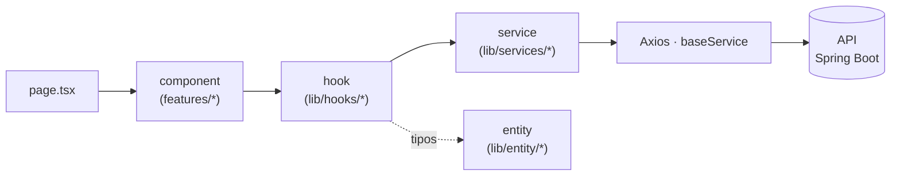

<div align="center">

# 🦷 Clinic Flow 360

### La plataforma SaaS que digitaliza la clínica dental — de la cita al odontograma, en tiempo real.

Agenda inteligente · Historia clínica · **Odontograma interactivo** · Campañas por WhatsApp · Roles y permisos.

<br/>

[](https://nextjs.org/)
[](https://react.dev/)
[](https://www.typescriptlang.org/)
[](https://tailwindcss.com/)


</div>

---

## 📖 Sobre el proyecto

**Clinic Flow 360** es el frontend web de un ecosistema SaaS para clínicas odontológicas, construido sobre **Next.js 15 (App Router)** y un sistema de diseño propio (**Bento** · Radix + shadcn + Tailwind). Su pieza estrella es un **odontograma clínico interactivo** que renderiza dientes anatómicos reales desde SVG y captura diagnósticos, planes y procedimientos con simbología estándar (FDI/ISO 3950).

> Este repositorio contiene **solo el frontend**. La API la sirve un servicio companion en **Spring Boot** (repo `backend-clinic`).

<br/>

## ✨ Características

| | Módulo | Descripción |
|:--:|---|---|
| 🗓️ | **Agenda** | Citas con disponibilidad por doctor, recordatorios y flujo de consulta en curso. |
| 👤 | **Pacientes** | Ficha integral, antecedentes médicos y adjuntos. |
| 🩺 | **Historia clínica** | Anamnesis, diagnósticos CIE-10, hallazgos de examen y evolución con autosave. |
| 🦷 | **Odontograma** | Superficies coloreables, ICDAS, planes/realizados y simbología clínica en 3 vistas. |
| 💬 | **Campañas WhatsApp** | Plantillas y envíos para comunicación con pacientes. |
| 🔐 | **Roles y permisos** | Control de acceso granular por acción (`usePermission`). |

<br/>

## 🧱 Stack

| Capa | Tecnología |
|---|---|
| **Framework** | Next.js 15 · App Router · React 18 · Turbopack |
| **Lenguaje** | TypeScript 5 (`strict`) |
| **UI (Bento)** | Tailwind CSS v4 · Radix UI / shadcn · `lucide-react` · tokens semánticos |
| **Estado** | Zustand 5 (odontograma) · Context API (auth / alertas) |
| **Formularios** | React Hook Form + Zod |
| **HTTP** | Axios (`lib/services/*`, boundary único) |
| **Auth** | JWT + OTP (refresh vía route handler) |
| **Gestor** | Yarn 1 (`yarn@1.22.22`) |

<br/>

## 🚀 Puesta en marcha

**Requisitos:** Node ≥ 18.18 · Yarn 1 · la API (`backend-clinic`) corriendo en `http://localhost:8080`.

```bash
# 1. Clonar
git clone git@github.com:feduvernal142315141/ClinicaDental.git
cd ClinicaDental

# 2. Instalar dependencias
yarn install

# 3. Variables de entorno
#    Copia la plantilla y ajusta los valores (mínimo NEXT_PUBLIC_API_URL):
cp .env.example .env.local

# 4. Levantar en modo desarrollo (Turbopack)
yarn dev
```

La app queda disponible en **http://localhost:3000** 🎉

<br/>

## 🔑 Variables de entorno

Todas llevan prefijo `NEXT_PUBLIC_` → se inyectan **en build** y quedan expuestas al navegador (no hay secretos). Plantilla completa en [`.env.example`](./.env.example). Los `.env*.local` están ignorados por git.

| Variable | Requerida | Descripción |
|---|:--:|---|
| `NEXT_PUBLIC_API_URL` | ✅ | URL del backend (`backend-clinic`). En local: `http://localhost:8080/`. |
| `NEXT_PUBLIC_UPLOAD_DRIVER` | — | Driver de subida de logo: `local` \| `cloudinary`. Si se omite → `local` en dev, `cloudinary` en prod. |
| `NEXT_PUBLIC_CLOUDINARY_CLOUD_NAME` | prod | Cloud name de Cloudinary (ver abajo). |
| `NEXT_PUBLIC_CLOUDINARY_UPLOAD_PRESET` | prod | Upload preset **unsigned** de Cloudinary. |
| `NEXT_PUBLIC_AUTH_DEBUG` | — | Loguea el flujo OTP/JWT en consola. |
| `NEXT_PUBLIC_SUPABASE_*` | legacy | Solo para código legacy en retirada (JWT-only es el objetivo). |

### 🖼️ Subida del logo — local vs. Cloudinary

El logo de la clínica se sube con un **driver seleccionable**:

- **`local`** (desarrollo) — sube a `/api/upload` y guarda en `public/uploads/`. Sin dependencias externas. Deshabilitado en producción (filesystem efímero).
- **`cloudinary`** (producción) — *unsigned upload* directo desde el navegador. Para activarlo:
  1. Crea una cuenta en **Cloudinary** y anota tu **Cloud name**.
  2. Crea un **Upload preset** en modo **Unsigned** (*Settings → Upload → Upload presets*). ⚠️ Si el preset es *Signed*, el navegador recibe **401 Unauthorized**.
  3. Define `NEXT_PUBLIC_CLOUDINARY_CLOUD_NAME` y `NEXT_PUBLIC_CLOUDINARY_UPLOAD_PRESET` en el hosting (Vercel) y **redeploy** (las `NEXT_PUBLIC_*` se resuelven en build).

> La CSP (`next.config.mjs`) y el validador del backend ya aceptan URLs de Cloudinary — solo falta la configuración de entorno.

<br/>

## 📜 Scripts

| Comando | Qué hace |
|---|---|
| `yarn dev` | Servidor de desarrollo con **Turbopack**. |
| `yarn dev:webpack` | Dev con Webpack (fallback). |
| `yarn build` | Build de producción (`NEXT_DIST_DIR=.next-build`). |
| `yarn start` | Sirve el build de producción. |
| `yarn lint` | ESLint (config legacy). |
| `yarn typecheck` | `tsc --noEmit` (chequeo de tipos). |

<br/>

## 🏛️ Arquitectura

El flujo de datos es unidireccional y por capas — la UI nunca habla con HTTP directamente:



**Reglas no negociables**

- **HTTP solo en `lib/services/*`** (Axios `baseService`); los tipos viven en `lib/entity/*`.
- **UI Bento**: componentes desde `@/components/ui`; toasts con `notify`; iconos `lucide-react`; copy en **español**.
- **Formularios** con React Hook Form + Zod, validación `onBlur`, floating labels, WCAG 2.2.
- **Tokens semánticos** (`canvas / surface / ink / brand / subtle / hairline`) para theming claro/oscuro.
- Datos solo-cliente (storage) → leer en `useEffect`, **nunca en render** (hidratación SSR).

<br/>

## 🦷 Módulo Odontograma

Un **módulo acotado** con frontera estricta — su API pública, store, dominio y adapters viven en `lib/odontogram/*`; la UI especializada en `components/features/odontogram/*`; y la integración con la pantalla del paciente en wrappers como `PatientOdontogramPanel`.

- **Render SVG anatómico**: el arte del diseñador se procesa (`scripts/extract-teeth-svg.mjs`) a datos que colorean superficies por geometría, no por número de zona.
- **Simbología clínica**: extracción (pieza roja), ausente (cruz azul/roja), endodoncia (`ENDO`), corona (anillo rojo/azul) e implante — con estados pendiente/realizado.
- **Persistencia por adapter**: el estado se guarda como JSON opaco; nada de HTTP dentro del módulo.

> Detalle técnico en la documentación interna del proyecto (odontograma clínico y pipeline de render SVG).

<br/>

## 🗂️ Estructura

```
front-clinic/
├─ app/                      # App Router (rutas, layouts, route handlers)
│  ├─ (authenticated)/       # rutas protegidas
│  └─ api/auth/*             # handlers de auth (OTP + JWT)
├─ components/
│  ├─ ui/                    # sistema Bento (Radix/shadcn + atómicos)
│  └─ features/              # UI por dominio (odontogram, patients, …)
├─ lib/
│  ├─ services/              # boundary HTTP (Axios)
│  ├─ entity/                # contratos tipados
│  ├─ hooks/                 # lógica de estado
│  └─ odontogram/            # módulo acotado (store, dominio, adapters)
└─ public/                   # estáticos (incl. SVG de dientes)
```

<br/>

## ✅ Calidad

Antes de abrir un PR:

```bash
yarn typecheck   # no subir el baseline de errores TS
yarn lint        # sin nuevas violaciones en archivos tocados
yarn build       # debe compilar y generar las páginas estáticas
```

> `next.config.mjs` ignora errores de TS/ESLint en el build, así que **`typecheck` y `lint` son los que mandan**. No hay runner de tests configurado — no asumas cobertura automática.

<br/>

## 🤝 Convenciones

- **Rama de integración:** `develop`. Trabaja en `feature/*` y abre PR hacia `develop`.
- **Commits:** [Conventional Commits](https://www.conventionalcommits.org/) (`feat`, `fix`, `refactor`, `chore`…).
- **UI en español** salvo que la pantalla ya use otro idioma.
- **Sin Ant Design en código nuevo** — el proyecto migra hacia Bento.

<br/>

---

<div align="center">

**Clinic Flow 360** · Kodewave Solutions
<br/>
Hecho con 🦷 y Next.js

</div>
