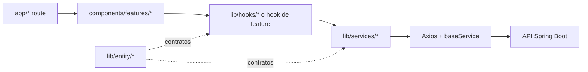

# Arquitectura

## Contexto del sistema

`front-clinic` es la aplicación web de Clinic Flow 360. El backend companion
`backend-clinic` expone la API REST y es propietario de persistencia,
autorización efectiva y reglas de negocio de servidor.

La cadena es una dirección preferida, no una obligación de crear cinco archivos
para toda tarea. Primero se replica la forma estable del dominio vecino.

## Capas y responsabilidades

| Ruta | Responsabilidad | No debe contener |
|---|---|---|
| `app/*` | rutas, layouts, loading/error y composición | acceso remoto incrustado en JSX |
| `app/api/*` | integración server-side, cookies y sesión | UI, Ant Design o helpers de navegador |
| `components/features/*` | presentación y composición por dominio | contratos HTTP improvisados |
| `components/ui/*` | primitivas y componentes reutilizables | reglas de negocio de una feature |
| `lib/hooks/*` | estado, orquestación y side effects del cliente | detalles visuales innecesarios |
| `lib/services/*` | endpoints y traducción de respuesta/error | navegación o componentes |
| `lib/entity/*` | DTO, entidades, esquemas y tipos | llamadas remotas |
| `lib/query/*` | DSL tipado de filtros, orden y búsquedas | columnas no permitidas por backend |
| `lib/permissions/*` | codificación y acciones de permisos | autorización de servidor |
| `lib/odontogram/*` | API pública, store, dominio y adapters del módulo | shell, routing o auth del host |

## App Router y composición global

`app/layout.tsx` es un Server Component. Delega la composición cliente a
`components/layout/root-client.tsx`, cuyo orden actual incluye:

1. registro y compatibilidad de Ant Design;
2. tema;
3. interceptores y carga global;
4. branding de clínica;
5. autenticación;
6. alertas, errores globales y command palette;
7. `AppChrome`;
8. analítica y toaster.

No duplicar providers en layouts de rutas. `app/(authenticated)/layout.tsx`
permanece deliberadamente liviano.

El middleware protege rutas por presencia del access token y deja pasar
`/api/*`; la autorización real de cada operación sigue perteneciendo al
backend.

## Dominios visibles

- autenticación;
- agenda y citas;
- pacientes, adjuntos e historia clínica;
- doctores;
- servicios;
- roles y permisos;
- campañas y plantillas;
- etiquetas;
- dashboard;
- configuración y branding;
- dictado/transcripción;
- odontograma y planes de tratamiento.

Cada dominio puede tener pequeñas variaciones históricas. Preservar el contrato
wire y encapsular las diferencias en su service, hook o adapter.

## Frontera del odontograma

El odontograma es un módulo embebido, no una feature convencional:

- `lib/odontogram/index.ts` es su API pública.
- `lib/odontogram/store.tsx` define snapshot, metadata, store y adapter.
- `lib/odontogram/adapters/*` implementa persistencia API, local o histórica.
- `components/features/odontogram/*` presenta UI clínica especializada.
- wrappers como `PatientOdontogramPanel.tsx` inyectan usuario, clínica, visita y
  callbacks del host.

El estado clínico se serializa como snapshot versionado. La carga fallida
bloquea autosave para evitar sobrescribir datos reales con un snapshot vacío.
No mover HTTP ni contexto de auth dentro de la UI del módulo.

## Flujo HTTP y errores

`apiConfig.ts` agrega Bearer token, actividad, carga global, refresh compartido
e idempotencia de expiración. `baseService.ts` devuelve la respuesta Axios o
`err.response`; por eso cada service debe verificar status/datos y llamar
`handleServiceError`. El hook añade feedback contextual con `notify` o
`notifyApiError`.

No añadir toasts globales y contextuales para el mismo error. El interceptor
normaliza y ejecuta side effects; la capa invocadora decide el mensaje útil.

## Permisos

Los permisos usan máscara de bits:

- `CREATE = 1`
- `EDIT = 2`
- `DELETE = 4`
- `BLOCK = 8`

La UI consulta `usePermission()` y `PermissionAction`. Ocultar o deshabilitar
una acción mejora UX, pero nunca sustituye la validación del backend.

## Regla para nuevas features

1. Localizar la ruta y el dominio más cercanos.
2. Definir o extender contratos en `lib/entity/<dominio>`.
3. Encapsular HTTP en `lib/services/<dominio>`.
4. Colocar orquestación reutilizable en hook central o colocalizado.
5. Mantener la página delgada y reutilizar `components/features/*`.
6. Aplicar permisos antes de mostrar acciones protegidas.
7. Validar estados loading, vacío, error, éxito y acceso denegado.
